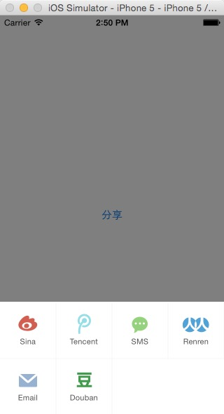

# CoreUmeng
友盟分享封装

-----
    Charlin出框架的目标：简单、易用、实用、高度封装、绝对解耦！
    
-----

  

框架截图 CUT
===============
基本功能演示： 
 
  

组织信息 Charlin Feng：
===============
 
#### 特别群：请西部省市朋友实名加入组织。其他地区朋友请添加2-4群：谢谢。
 
【西部区域】西部大开发群号： 473185026  -追赶北上广！为振兴西部IT而努力！ 
热烈欢迎中国西部各省市的从事iOS开发朋友实名进群！本群为是聚集西部零散开发者，大家齐心协力共进退！   

【全国可加】四群： 347446259 
新开，可加！欢迎全国朋友加入组织   

【全国可加】三群： 474377358 
新开，可加！欢迎全国朋友加入组织   

【全国可加】二群： 369870753 
**WORNING: 已爆满，加不上了**  

【全国可加】一群：163865401 
**WORNING: 已爆满，加不上了**  

  

  
####框架特性： 
>1.封装了友盟分享。统一了API，简化了调用api的复杂度。 
>2.集成SSO授权。 
>3.框架内部处理了所有的分享细节，错误与提示。基本可以一键集成，且集成后你不需要考虑异常。 
>4.处理了未安装app的隐藏，不会导致上架被拒。 

使用说明 USAGE
===============
 
集成SSO授权，需要引入系统库： 
Security.framework 
libiconv.dylib 
SystemConfiguration.framework 
CoreGraphics.Framework 
libsqlite3.dylib 
CoreTelephony.framework 
libstdc++.dylib 
libz.dylib 

此外，关于设置URL SCKEME请查阅官方文档：http://dev.umeng.com/social/ios/detail-share#1
 

#### 1.导入头文件
    #import "CoreUMeng.h"

#### 2.集成功能
    
    - (BOOL)application:(UIApplication *)application didFinishLaunchingWithOptions:(NSDictionary *)launchOptions {
      
      //设置AppKey
      [CoreUMeng umengSetAppKey:UmengAppKey];
      //集成新浪
      [CoreUMeng umengSetSinaSSOWithRedirectURL:@"http://www.baidu.com"];
      //集成微信
      [CoreUMeng umengSetWXAppId:WXAPPID appSecret:WXAPPsecret url:WXUrl];
      //集成QQ
      [CoreUMeng umengSetQQAppId:@"100424468" appSecret:@"c7394704798a158208a74ab60104f0ba" url:@"http://www.umeng.com/social"];
      // Override point for customization after application launch.
      return YES;
    }

#### 3.SSO授权调
    - (BOOL)application:(UIApplication *)application handleOpenURL:(NSURL *)url{
        return  [CoreUMeng umengHandleOpenURL:url];
    }
    - (BOOL)application:(UIApplication *)application openURL:(NSURL *)url sourceApplication:(NSString *)sourceApplication annotation:(id)annotation{
        return  [CoreUMeng umengHandleOpenURL:url];
    }

#### 4.使用
    - (IBAction)share:(id)sender {
    
    [CoreUmengShare show:self text:@"我是友盟分享文字" image:[UIImage imageNamed:@"show"]];
    
    }
    

